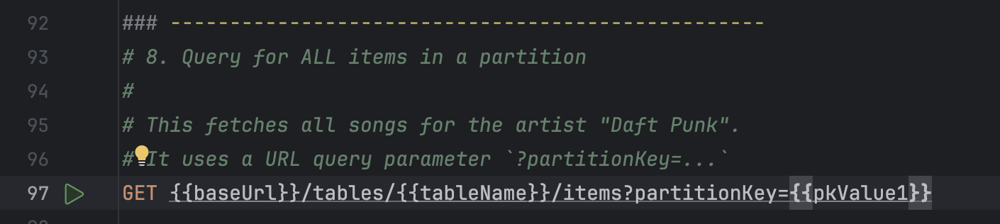

# JKeyDB - A DynamoDB-Inspired Database from Scratch

**JKeyDB** is a fully functional, single-node NoSQL key-value database built from the ground up in **Java** and **Spring Boot**.  
This project was undertaken as a **7-day deep dive** to understand the **core principles** behind modern distributed data systems like **Amazon DynamoDB**.

It’s not just a simple key-value store — it implements a **durable persistence layer**, **composite primary keys**, and a **high-performance query API**, mimicking the foundational architecture that allows DynamoDB to operate at scale.

---

## Core Concepts & Architecture

JKeyDB's design is inspired by DynamoDB’s elegant data model.  
The easiest way to visualize it is with a **filing cabinet analogy**:

- **Table (Music, Users)** → The entire filing cabinet — a container for related items.
- **Partition Key (Artist)** → The label on a drawer — determines data distribution.
- **Sort Key (SongTitle)** → The label on a file folder inside a drawer — allows efficient range-based queries.

This architecture is implemented through three main components:

### Components

1. **Storage Engine**
    - Uses `ConcurrentHashMap` (for partitions) and `ConcurrentSkipListMap` (for sorted items within a partition).
    - Models the exact structure of **Partition Key** and **Sort Key**.

2. **Durability (Write-Ahead Log)**
    - Every modification is recorded to `wal.log` *before* being applied to memory.
    - On startup, the log is **replayed** to restore full database state.
    - Ensures **zero data loss** from crashes or restarts.

3. **API Layer**
    - Built using **Spring Web**.
    - Provides clean RESTful endpoints for all CRUD and query operations.

---

## Key Features

 **Durable Persistence** — Uses a Write-Ahead Log (WAL) for crash recovery.  
 **Composite Primary Keys** — Supports both Partition and Sort keys.  
 **High-Performance Query API** — Efficiently retrieves all items under a given partition.  
 **State Recovery** — Rebuilds memory state by replaying the WAL at startup.  
 **RESTful API** — Simple, clean, and intuitive endpoints.

---

## Technology Stack

| Component | Technology |
|------------|-------------|
| **Language** | Java 17 |
| **Framework** | Spring Boot 3 |
| **Build Tool** | Maven |
| **Dependencies** | Spring Web, Lombok, Jackson |

---

## Showcase Screenshots

### 1. JKeyDB System Architecture

### 2. The Write-Ahead Log (Proof of Durability)

### 3. The High-Performance Query API in Action

### 4. State Recovery on Startup (Proof of Fault Tolerance)

## 🚀 Getting Started

### 🧩 Prerequisites
- Java 17 (or later)
- Apache Maven 3.8 (or later)

### ▶️ Running the Application

# Clone the repository
> git clone https://github.com/someear9h/JKeyDB.git
> 
> cd JKeyDB

# Run the Spring Boot app
> mvn spring-boot:run

The server will start at http://localhost:8080

Use api-requests.http in IntelliJ or any API client to test the endpoints.

| Method     | Endpoint                                             | Description                      |
| ---------- | ---------------------------------------------------- | -------------------------------- |
| **POST**   | `/api/v1/tables`                                     | Creates a new table              |
| **POST**   | `/api/v1/tables/{tableName}/items`                   | Adds or updates an item          |
| **GET**    | `/api/v1/tables/{tableName}/items/{pk}/{sk}`         | Retrieves a specific item        |
| **DELETE** | `/api/v1/tables/{tableName}/items/{pk}/{sk}`         | Deletes a specific item          |
| **GET**    | `/api/v1/tables/{tableName}/items?partitionKey={pk}` | Queries all items in a partition |

## Key Learnings & Takeaways

### **Durability is Paramount**:
A database is not a database without durability. Implementing a WAL from scratch provided a deep appreciation for the guarantees that production systems provide.

### **Data Modeling Drives Performance**: 
The choice of the nested SortedMap was not arbitrary; it was the key that unlocked the high-performance range queries, demonstrating that how you store data is just as important as how you access it.

### **The Power of the Public/Private Service Pattern**: 
Separating the "public" methods that log operations from the "private" methods that modify state was critical for creating clean, bug-free replay logic.

### **Future Improvements**

- JKeyDB is a successful implementation of a single-node database. The next logical steps to evolve this into a true distributed system would be:

- Distribution: Implement a consistent hashing ring to distribute partitions across multiple nodes.

- Replication: Add a replication layer where each WAL entry is sent to multiple follower nodes before a write is considered successful, likely using a Quorum system.

- Conflict Resolution: Introduce vector clocks or last-write-wins timestamps to handle concurrent writes to the same item in a multi-node environment.

